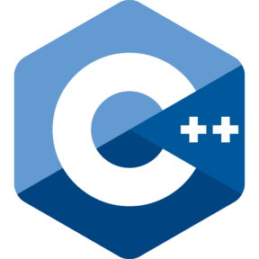

### Hi ! 👋

###
<h1>About</h1>
I'm a full stack developer who is passionate about customizing open-source more accessible and reliable, creating technology to elevate people, and solving challenges. Some technologies I enjoy working with include JS, PHP, Python, Java, Objective-C and .Net Core, Ruby. I have participated in development of large scale e-commerce platforms and app developments. Also familiar with query optimization and handling big data and data center.

###

<h1>What I'm focusing on</h1>

Software development is very challenging and need to think of lots of solutions. Depending on the solution, we have to research proper tech can face unexpected things. I have focused on updating a HSP.

<h1>Languages and Tools<h1>

    <code>
        
    </code>
    <code>
        
    </code>
    <code>
        
    </code>
    <code>
        
    </code>
    <code>
        
    </code>
    <code>
        
    </code>
    <code>
        
    </code>
    <code>
        
    </code>
    <code>
        
    </code>

    <code>
        
    </code> 
    <code>
        
    </code>
    </code> 
    <code>
        
    </code> 

    <code>
        
    </code>
    <code>
        
    </code>
    <code>
        
    </code>
    <code>
        
    </code>
    <code>
        
    </code>

<!--
**expert-git/expert-git** is a ✨ _special_ ✨ repository because its `README.md` (this file) appears on your GitHub profile.

Here are some ideas to get you started:

- 🔭 I’m currently working on ...
- 🌱 I’m currently learning ...
- 👯 I’m looking to collaborate on ...
- 🤔 I’m looking for help with ...
- 💬 Ask me about ...
- 📫 How to reach me: ...
- 😄 Pronouns: ...
- ⚡ Fun fact: ...
-->
